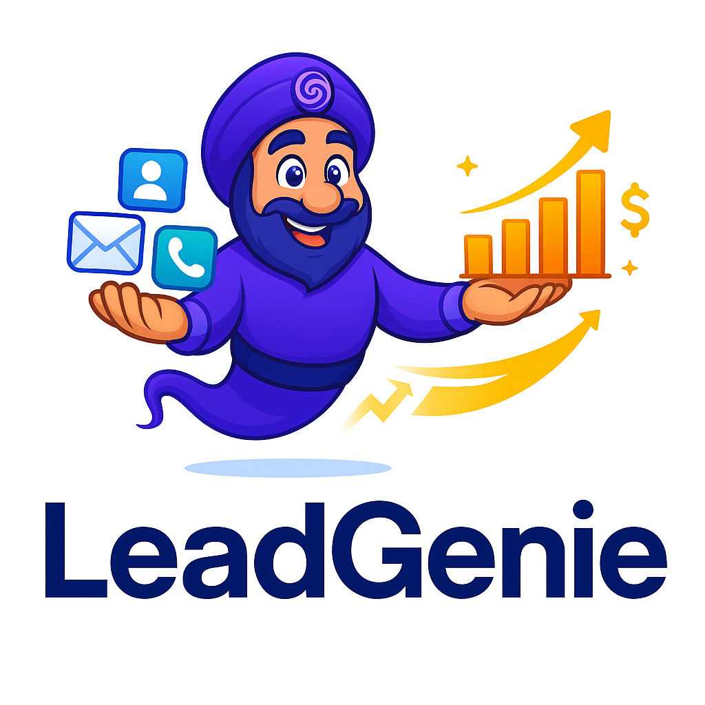

# LeadGenie - AI-Powered CRM & Lead Generation Platform

<div align="center">
  
  
  <p align="center">
    A modern, full-stack CRM application with intelligent lead generation, automated outreach, and comprehensive sales pipeline management.
  </p>

  <p align="center">
    <a href="#features">Features</a> •
    <a href="#tech-stack">Tech Stack</a> •
    <a href="#architecture">Architecture</a> •
    <a href="#getting-started">Getting Started</a> •
    <a href="#deployment">Deployment</a>
  </p>
</div>

---

## 🎯 Project Overview

LeadGenie is an enterprise-grade Customer Relationship Management (CRM) platform designed to streamline lead generation, automate sales workflows, and enhance customer engagement. Built with modern web technologies, it combines powerful AI capabilities with an intuitive user interface to help businesses scale their sales operations efficiently.

### Key Highlights

- **AI-Powered Intelligence**: Leverages Google Gemini and OpenAI GPT models for intelligent email generation, automated responses, and lead qualification
- **Real-Time Collaboration**: Multi-user support with role-based access control and team collaboration features
- **Comprehensive Email Integration**: Native support for Gmail, SendGrid, Resend, and SMTP with deliverability tracking
- **Advanced Pipeline Management**: Visual Kanban board, deal tracking, and automated workflow management
- **Invoice & Quotation System**: Built-in billing with AI-generated email templates
- **Lead Intelligence**: Automated lead finder with multi-source data aggregation and quality scoring

---

## ✨ Features

### 🔍 Lead Generation & Management
- **Intelligent Lead Finder**: Multi-source lead discovery using GetProspect API and Perplexity AI
- **Real-Time Streaming**: Live lead discovery with streaming search results
- **Data Quality Scoring**: Automated quality assessment with completeness metrics
- **Contact Enrichment**: Automatic data enhancement and validation
- **Company Profiles**: Comprehensive company management with detailed contact tracking

### 📧 Email Automation
- **AI Email Generation**: Context-aware email composition using advanced language models
- **Multi-Provider Support**: Gmail OAuth, SendGrid, Resend, and SMTP integration
- **Email Sequences**: Automated drip campaigns with customizable steps
- **Deliverability Tracking**: Real-time open rates, click tracking, and engagement metrics
- **Auto-Responder**: Intelligent AI-powered email response automation
- **Template System**: Reusable email templates with variable substitution

### 💼 Sales Pipeline
- **Visual Kanban Board**: Drag-and-drop deal management
- **Custom Deal Stages**: Configurable pipeline with automated stage progression
- **Deal Analytics**: Revenue forecasting and conversion tracking
- **Activity Logging**: Comprehensive audit trail for all deal interactions
- **Task Management**: Integrated to-do lists and reminders

### 📊 Business Intelligence
- **Real-Time Dashboard**: Live metrics and KPI tracking
- **Campaign Analytics**: Engagement timeline and performance metrics
- **Team Performance**: User activity monitoring and reporting
- **Email Engagement Tracker**: Live tracking of email interactions
- **Revenue Forecasting**: Predictive analytics for sales pipeline

### 🧾 Invoicing & Quotations
- **Invoice Generation**: Create and manage professional invoices
- **Quotation System**: Proposal generation with approval workflows
- **Email Integration**: Direct invoice delivery with AI-generated cover emails
- **Status Tracking**: Real-time payment and approval status monitoring

### 👥 Team Collaboration
- **Role-Based Access Control**: Admin, Manager, and Member roles
- **Team Workspaces**: Multi-team support with isolated data
- **Internal Notes**: Private team communication on deals and contacts
- **Activity Notifications**: Real-time updates on team activities
- **Team Invitations**: Email-based invitation system

### 🔐 Security & Compliance
- **Row-Level Security (RLS)**: Database-level access control
- **JWT Authentication**: Secure session management
- **Data Encryption**: End-to-end encryption for sensitive data
- **Audit Logging**: Comprehensive activity tracking
- **Email Verification**: Domain validation and SPF/DKIM checking

---

## 🛠 Tech Stack

### Frontend
```
React 18.3.1          - UI library with hooks and functional components
TypeScript 5.x        - Type-safe development
Vite 5.x              - Next-generation frontend tooling
TailwindCSS 3.x       - Utility-first CSS framework
Shadcn/ui             - High-quality component library
TanStack Query 5.x    - Powerful data synchronization
React Router 6.x      - Client-side routing
Zustand               - Lightweight state management
Tiptap                - Rich text editor for email composition
DnD Kit               - Drag-and-drop functionality
Recharts              - Data visualization
```

### Backend
```
Supabase              - Backend-as-a-Service platform
PostgreSQL            - Relational database with full-text search
Edge Functions        - Serverless Deno runtime
Row-Level Security    - Database-level access control
Realtime              - WebSocket-based live updates
Storage               - File storage with CDN
```

### AI & External Services
```
Lovable AI Gateway    - Unified AI model access
Google Gemini 2.5     - Advanced language model
OpenAI GPT-5          - Latest GPT model integration
GetProspect API       - Contact data enrichment
Perplexity AI         - Intelligent web search
Exa API               - Advanced search capabilities
```

### Email Services
```
SendGrid              - Enterprise email delivery
Resend                - Modern email API
Gmail OAuth           - Native Gmail integration
SMTP                  - Direct mail server support
Nango                 - OAuth integration framework
```

### DevOps & Tools
```
Git                   - Version control
ESLint                - Code linting
TypeScript            - Static type checking
Bun                   - Fast JavaScript runtime
```

---

## 🏗 Architecture

### System Architecture

```
┌─────────────────────────────────────────────────────────┐
│                     Client Layer                         │
│  ┌──────────┐  ┌──────────┐  ┌──────────┐             │
│  │  React   │  │  Zustand │  │  React   │             │
│  │   App    │  │  Store   │  │  Query   │             │
│  └──────────┘  └──────────┘  └──────────┘             │
└─────────────────────────────────────────────────────────┘
                         ▼
┌─────────────────────────────────────────────────────────┐
│                   API Gateway Layer                      │
│              Supabase Client SDK                         │
└─────────────────────────────────────────────────────────┘
                         ▼
┌─────────────────────────────────────────────────────────┐
│                  Backend Services                        │
│  ┌──────────┐  ┌──────────┐  ┌──────────┐             │
│  │PostgreSQL│  │  Edge    │  │ Realtime │             │
│  │ Database │  │Functions │  │WebSocket │             │
│  └──────────┘  └──────────┘  └──────────┘             │
└─────────────────────────────────────────────────────────┘
                         ▼
┌─────────────────────────────────────────────────────────┐
│              External Services Layer                     │
│  ┌──────────┐  ┌──────────┐  ┌──────────┐             │
│  │   AI     │  │  Email   │  │   Lead   │             │
│  │ Models   │  │Providers │  │  APIs    │             │
│  └──────────┘  └──────────┘  └──────────┘             │
└─────────────────────────────────────────────────────────┘
```

### Database Schema

The application uses PostgreSQL with the following core tables:
- **profiles**: User account information
- **teams**: Organization workspaces
- **companies**: Company/account records
- **contacts**: Individual contact records
- **deals**: Sales opportunities
- **invoices**: Billing and quotations
- **email_activities**: Email tracking and engagement
- **email_sequences**: Automated campaign management
- **crm_connections**: Third-party integrations

### Edge Functions

Serverless functions handling business logic:
- `lead-finder`: Multi-source lead discovery
- `generate-email-with-ai`: AI-powered email composition
- `send-crm-email`: Multi-provider email delivery
- `generate-sequence`: AI sequence creation
- `personalize-sequence`: Context-aware sequence customization
- `process-inbound-emails`: Email webhook processing
- `email-webhook`: Engagement tracking

---

## 🚀 Getting Started

### Prerequisites

```bash
Node.js >= 18.x
Bun >= 1.x (or npm/yarn)
Git
Supabase CLI (optional, for local development)
```

### Installation

1. **Clone the repository**
```bash
git clone https://github.com/yourusername/leadgenie.git
cd leadgenie
```

2. **Install dependencies**
```bash
bun install
# or
npm install
```

3. **Environment Setup**

Create a `.env` file in the project root:
```env
# Supabase Configuration
VITE_SUPABASE_URL=your_supabase_url
VITE_SUPABASE_PUBLISHABLE_KEY=your_publishable_key

# Optional: For local development
SUPABASE_SERVICE_ROLE_KEY=your_service_role_key
```

4. **Start Development Server**
```bash
bun dev
# or
npm run dev
```

The application will be available at `http://localhost:5173`

### Supabase Setup

1. **Create a Supabase Project**
   - Go to [supabase.com](https://supabase.com)
   - Create a new project
   - Note your project URL and anon key

2. **Run Database Migrations**
```bash
# Install Supabase CLI
npm install -g supabase

# Link your project
supabase link --project-ref your-project-ref

# Push migrations
supabase db push
```

3. **Configure Secrets**

In your Supabase dashboard, add the following secrets:
- `LOVABLE_API_KEY`: AI model access
- `SENDGRID_API_KEY`: Email delivery
- `RESEND_API_KEY`: Alternative email provider
- `GETPROSPECT_API_KEY`: Lead enrichment
- `PERPLEXITY_API_KEY`: AI search
- `EXA_API_KEY`: Advanced search

4. **Deploy Edge Functions**
```bash
supabase functions deploy
```

---

## 📝 Usage

### Creating Your First Lead

1. Navigate to **Lead Finder** in the sidebar
2. Enter search criteria (industry, location, etc.)
3. Click **Start Search** to begin AI-powered discovery
4. Review results and save promising leads
5. View detailed company information in the Companies page

### Setting Up Email Campaigns

1. Go to **Settings** → **Email Providers**
2. Connect your email account (Gmail, SendGrid, or Resend)
3. Navigate to **Sequences** and create a new sequence
4. Use AI to generate personalized email steps
5. Assign companies to the sequence
6. Monitor engagement in real-time

### Managing Your Pipeline

1. Access **Pipeline** to view the Kanban board
2. Create deals and drag them through stages
3. Add notes and track activities
4. Use **Deals** page for detailed analytics
5. Generate invoices directly from closed deals

---

## 🔧 Configuration

### Email Provider Setup

#### Gmail OAuth
1. Configure Google Cloud Console OAuth credentials
2. Add authorized redirect URIs
3. Enable Gmail API
4. Connect in Settings → Email Providers

#### SendGrid
1. Create SendGrid account
2. Verify sender domain
3. Generate API key
4. Configure webhook endpoint for tracking

#### Resend
1. Sign up at resend.com
2. Add and verify domain
3. Generate API key
4. Connect in application settings

### AI Model Configuration

The application uses Lovable AI Gateway for unified access:
- **google/gemini-2.5-flash**: Default for most operations (fast, cost-effective)
- **google/gemini-2.5-pro**: Complex reasoning and analysis
- **openai/gpt-5**: Alternative high-performance model

---

## 🧪 Testing

### Running Tests
```bash
# Run all tests
bun test

# Run with coverage
bun test --coverage

# Run specific test file
bun test src/components/SendEmailDialog.test.tsx
```

### E2E Testing
```bash
# Install Playwright
bun add -D @playwright/test

# Run E2E tests
bun playwright test
```

---

## 📦 Building for Production

```bash
# Create production build
bun run build

# Preview production build
bun run preview
```

### Build Output
```
dist/
├── index.html
├── assets/
│   ├── index-[hash].js
│   ├── index-[hash].css
│   └── [images and fonts]
└── ...
```

---

## 🚀 Deployment

### Vercel Deployment

```bash
# Install Vercel CLI
npm i -g vercel

# Deploy
vercel --prod
```

### Netlify Deployment

```bash
# Build command
bun run build

# Publish directory
dist
```

### Docker Deployment

```dockerfile
# Dockerfile included in project
docker build -t leadgenie .
docker run -p 3000:3000 leadgenie
```

---

## 🔐 Security Considerations

- **Row-Level Security**: All database tables have RLS policies
- **Authentication**: JWT-based with secure refresh tokens
- **API Keys**: Stored as encrypted Supabase secrets
- **CORS**: Configured for production domains only
- **Rate Limiting**: Implemented on Edge Functions
- **Email Verification**: Required for sensitive operations

---

## 🤝 Contributing

This project was developed as a technical demonstration. While it is not currently accepting contributions, feel free to fork and adapt for your own use.

### Code Style

- **ESLint**: Enforced via pre-commit hooks
- **TypeScript**: Strict mode enabled
- **Prettier**: Automated formatting
- **Conventional Commits**: Commit message standards

---

## 📄 License

This project is provided as-is for demonstration purposes.

---

## 👨‍💻 Developer

**Your Name**
- Portfolio: [your-portfolio.com](https://your-portfolio.com)
- LinkedIn: [linkedin.com/in/yourprofile](https://linkedin.com/in/yourprofile)
- GitHub: [@yourusername](https://github.com/yourusername)

---

## 🙏 Acknowledgments

- **Supabase**: For the powerful backend platform
- **Lovable**: For AI infrastructure and development tools
- **Shadcn/ui**: For the beautiful component library
- **TanStack**: For excellent data management tools

---

## 📞 Support

For questions or issues related to this technical demonstration, please open an issue in the repository or contact me directly.

---

<div align="center">
  <p>Built with ❤️ using React, TypeScript, and Supabase</p>
  <p>© 2025 LeadGenie - AI-Powered CRM Platform</p>
</div>
