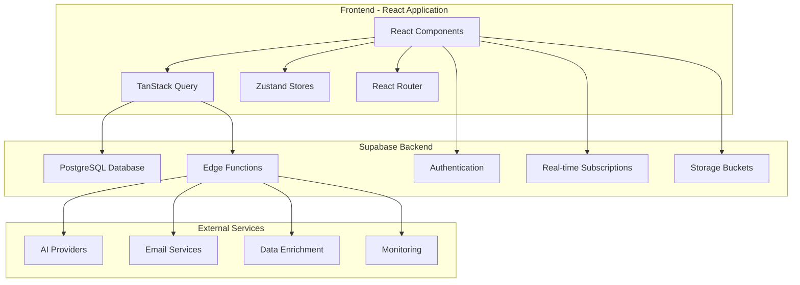
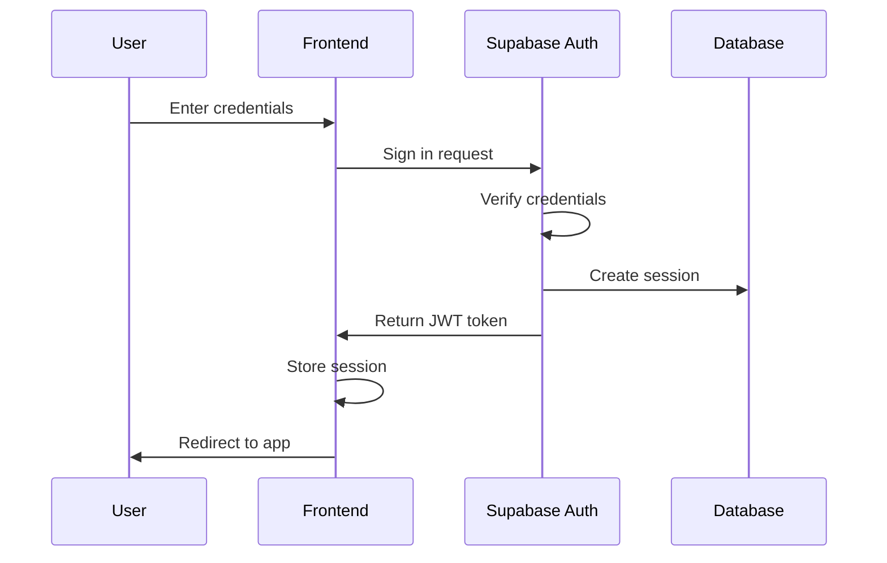
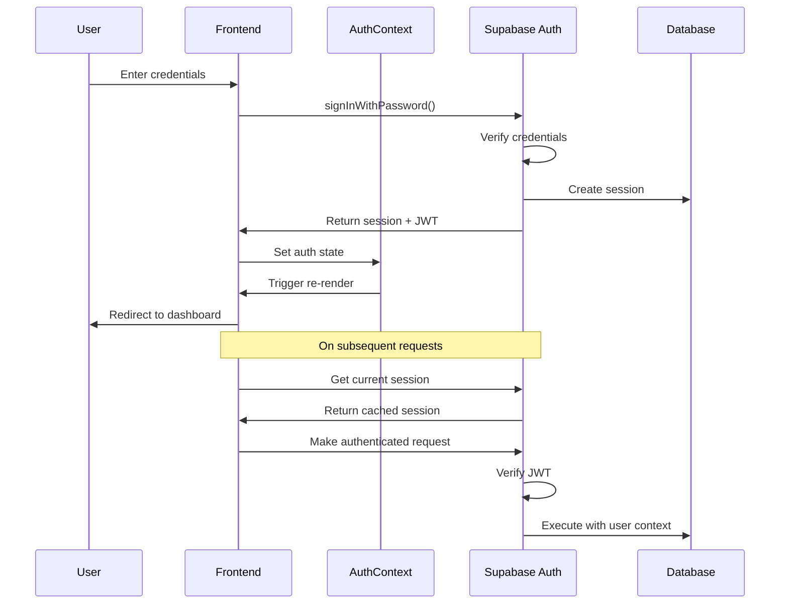
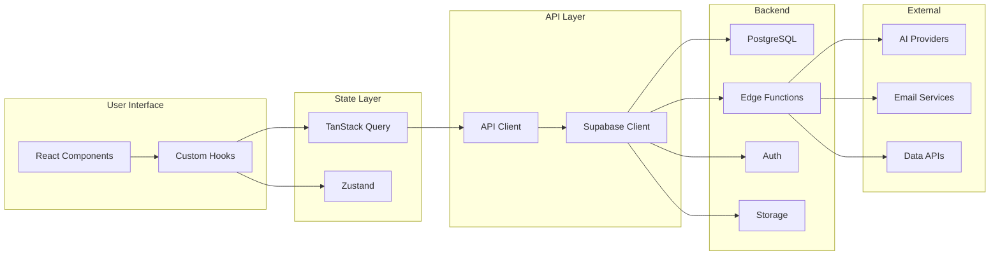
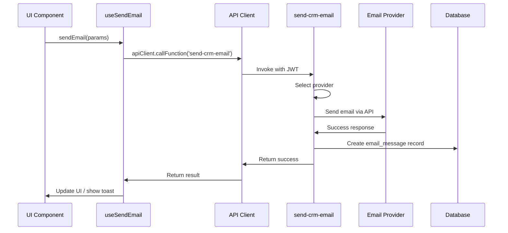
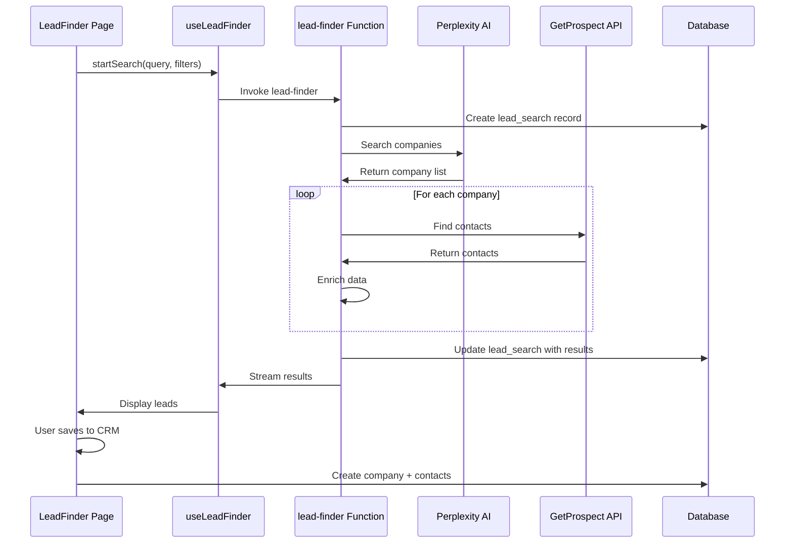
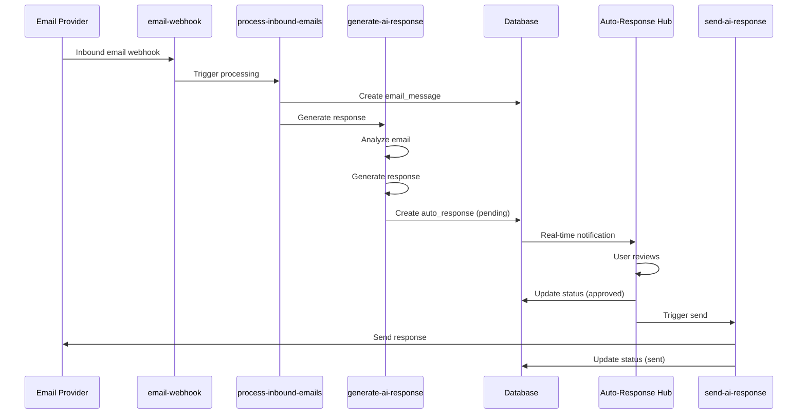

# LeadGenie CRM - Technical Stack Documentation

## Table of Contents
- [Architecture Overview](#architecture-overview)
- [Frontend Stack](#frontend-stack)
- [Backend Stack](#backend-stack)
- [Database Schema](#database-schema)
- [Edge Functions](#edge-functions)
- [External Integrations](#external-integrations)
- [State Management](#state-management)
- [API Client Architecture](#api-client-architecture)
- [Authentication Flow](#authentication-flow)
- [Real-time Features](#real-time-features)
- [File Storage](#file-storage)
- [Configuration](#configuration)
- [How Components Connect](#how-components-connect)
- [Development Workflow](#development-workflow)

---

## Architecture Overview

LeadGenie CRM is built as a modern, full-stack web application using React for the frontend and Supabase as the backend-as-a-service platform.

### High-Level Architecture



### Technology Choices

**Why React?**
- Component-based architecture for reusability
- Large ecosystem and community
- Excellent developer experience
- Strong TypeScript support

**Why Supabase?**
- Managed PostgreSQL with excellent performance
- Built-in authentication
- Real-time subscriptions out of the box
- Edge functions for serverless backend logic
- Row Level Security (RLS) for data protection

**Why Vite?**
- Fast development server with HMR
- Optimized production builds
- Native ESM support
- Simple configuration

---

## Frontend Stack

### Core Framework

#### React 18.3.1
**Purpose**: UI framework and component architecture

**Key Features Used:**
- Functional components with hooks
- Context API for global state
- Suspense for code splitting
- Concurrent rendering features

**Component Structure:**
```
src/
├── components/          # Reusable UI components
│   ├── ui/             # Base UI components (shadcn/ui)
│   ├── features/       # Feature-specific components
│   ├── integrations/   # Integration-related components
│   └── ...
├── pages/              # Route-level page components
├── hooks/              # Custom React hooks
└── contexts/           # React context providers
```

#### TypeScript
**Purpose**: Type safety and improved developer experience

**Usage:**
- Interface definitions for all data models
- Type-safe API calls
- Prop type checking
- Generic type utilities

**Example:**
```typescript
// src/lib/api/contacts.ts
export interface Contact {
  id: string;
  company_id: string;
  name: string;
  email?: string;
  phone?: string;
  title?: string;
  // ... more fields
}
```

### Build Tool

#### Vite
**Purpose**: Development server and build tool

**Configuration** (`vite.config.ts`):
- React plugin for JSX/TSX support
- Path aliases (`@/` → `src/`)
- Sentry plugin for source map uploads
- Environment variable handling

**Features:**
- Hot Module Replacement (HMR)
- Fast cold starts
- Optimized bundle splitting
- Tree shaking

### Routing

#### React Router v6.30.1
**Purpose**: Client-side routing and navigation

**Key Features:**
- Nested routes
- Protected routes with authentication
- Route-based code splitting
- Search params handling

**Router Configuration** (`src/App.tsx`):
```typescript
<Routes>
  <Route path="/auth" element={<Auth />} />
  <Route path="/*" element={
    <ProtectedRoute>
      <Routes>
        <Route path="/" element={<Dashboard />} />
        <Route path="/companies" element={<Companies />} />
        <Route path="/deals" element={<Deals />} />
        // ... more routes
      </Routes>
    </ProtectedRoute>
  } />
</Routes>
```

**Protected Routes:**
- `ProtectedRoute`: Requires authentication
- `RoleGuard`: Requires specific role (Admin, Sales Rep, Viewer)

### State Management

#### TanStack Query v5.83.0
**Purpose**: Server state management and caching

**Key Features:**
- Automatic caching
- Background refetching
- Optimistic updates
- Query invalidation
- Pagination support

**Example Usage:**
```typescript
// src/hooks/use-companies.ts
const { data: companies, isLoading } = useQuery({
  queryKey: ['companies', filters],
  queryFn: () => companiesApi.getCompanies(filters),
});
```

**Query Keys Organization:**
```typescript
['companies'] // All companies
['companies', { status: 'lead' }] // Filtered companies
['company', companyId] // Single company
['deals'] // All deals
['sequences'] // All sequences
```

#### Zustand v5.0.8
**Purpose**: Client-side UI state management

**Stores:**

**Provider Store** (`src/stores/provider-store.ts`):
```typescript
interface ProviderStore {
  emailProvider: EmailProvider;
  setEmailProvider: (provider: EmailProvider) => void;
  getDefaultProvider: () => EmailProvider;
}
```

**UI Store** (`src/stores/ui-store.ts`):
- Sidebar collapse state
- Modal open/close states
- Filter preferences
- View preferences (table/kanban)

### Styling

#### Tailwind CSS
**Purpose**: Utility-first CSS framework

**Configuration** (`tailwind.config.ts`):
- Custom color palette with HSL values
- Extended theme with semantic tokens
- Custom animations
- Responsive breakpoints

**Design System** (`src/index.css`):
```css
:root {
  --primary: 222.2 47.4% 11.2%;
  --secondary: 210 40% 96.1%;
  --accent: 210 40% 96.1%;
  --destructive: 0 84.2% 60.2%;
  // ... more design tokens
}
```

#### Shadcn/ui Components
**Purpose**: Pre-built, accessible UI components

**Based on:**
- Radix UI primitives (headless components)
- Tailwind CSS for styling
- Class Variance Authority (CVA) for variants

**Key Components:**
- `Button`, `Input`, `Select`, `Dialog`, `Dropdown`
- `Table`, `Card`, `Tabs`, `Sheet`
- `Form` components with React Hook Form integration
- `Toast` notifications with Sonner

### Icons and Assets

#### Lucide React v0.462.0
**Purpose**: Icon library

**Usage:**
```typescript
import { Mail, Users, TrendingUp } from 'lucide-react';
```

### Form Management

#### React Hook Form v7.61.1
**Purpose**: Form state management and validation

**Integration with Zod:**
```typescript
const formSchema = z.object({
  name: z.string().min(1, "Name is required"),
  email: z.string().email("Invalid email"),
});

const form = useForm<z.infer<typeof formSchema>>({
  resolver: zodResolver(formSchema),
});
```

#### Zod v4.1.12
**Purpose**: Schema validation

**Usage:**
- Form validation
- API response validation
- Type inference

### Data Visualization

#### Recharts v3.3.0
**Purpose**: Charts and graphs

**Used For:**
- Campaign analytics
- Email engagement charts
- Deal pipeline metrics
- Performance dashboards

### Notifications

#### Sonner v1.7.4
**Purpose**: Toast notifications

**Usage:**
```typescript
import { toast } from 'sonner';

toast.success('Company created successfully');
toast.error('Failed to send email');
```

### Date Handling

#### date-fns v3.6.0
**Purpose**: Date manipulation and formatting

**Common Functions:**
- `format()` - Date formatting
- `parseISO()` - Parse ISO strings
- `addDays()`, `subDays()` - Date arithmetic
- `isAfter()`, `isBefore()` - Date comparisons

### Rich Text Editing

#### TipTap
**Purpose**: WYSIWYG editor for email composition

**Extensions:**
- `@tiptap/react` - React integration
- `@tiptap/starter-kit` - Basic editing features
- `@tiptap/extension-placeholder` - Placeholder text

**Used In:**
- Email composition
- Sequence creation
- Notes and descriptions

### Drag and Drop

#### dnd-kit
**Purpose**: Accessible drag-and-drop

**Packages:**
- `@dnd-kit/core` - Core functionality
- `@dnd-kit/sortable` - Sortable lists
- `@dnd-kit/utilities` - Helper utilities

**Used In:**
- Kanban board (Pipeline view)
- Sortable lists
- File uploads

---

## Backend Stack

### Supabase Platform

#### Overview
Supabase is an open-source Firebase alternative built on PostgreSQL.

**Core Services:**
- PostgreSQL database with extensions
- Authentication (GoTrue)
- Edge Functions (Deno runtime)
- Real-time subscriptions
- Storage (S3-compatible)
- Auto-generated REST and GraphQL APIs

### PostgreSQL Database

#### Version
PostgreSQL 15+ with Supabase extensions

#### Extensions Used
- `uuid-ossp` - UUID generation
- `pg_trgm` - Full-text search
- `pgcrypto` - Encryption functions

#### Row Level Security (RLS)

**Purpose**: Database-level access control

**Example Policies:**
```sql
-- Users can only view their own organization's companies
CREATE POLICY "Users can view own org companies"
ON companies FOR SELECT
USING (organization_id = auth.jwt() ->> 'organization_id');

-- Users can only update their own organization's companies
CREATE POLICY "Users can update own org companies"
ON companies FOR UPDATE
USING (organization_id = auth.jwt() ->> 'organization_id');
```

**Benefits:**
- Security at database level
- Cannot be bypassed by API
- Works with all Supabase clients
- Reduces backend code

### Authentication

#### Supabase Auth (GoTrue)

**Features:**
- Email/password authentication
- OAuth providers (Google, planned: LinkedIn)
- JWT tokens
- Session management
- Email verification
- Password reset

**Auth Flow:**


**JWT Payload:**
```json
{
  "sub": "user-uuid",
  "email": "user@example.com",
  "role": "authenticated",
  "organization_id": "org-uuid",
  "user_role": "admin",
  "iat": 1234567890,
  "exp": 1234571490
}
```

### Edge Functions (Deno Runtime)

#### Overview
Edge functions are serverless functions that run on Deno runtime.

**Key Features:**
- TypeScript native
- Fast cold starts
- Web standard APIs
- Built-in security
- Automatic scaling

**Function Structure:**
```typescript
import { serve } from "https://deno.land/std@0.168.0/http/server.ts";

serve(async (req) => {
  // CORS handling
  if (req.method === 'OPTIONS') {
    return new Response(null, { headers: corsHeaders });
  }
  
  // Get auth session
  const authHeader = req.headers.get('Authorization');
  const token = authHeader?.replace('Bearer ', '');
  
  // Your logic here
  const result = await processRequest();
  
  return new Response(JSON.stringify(result), {
    headers: { ...corsHeaders, 'Content-Type': 'application/json' },
  });
});
```

---

## Database Schema

### Core Tables

#### users (Auth Schema)
**Purpose**: User authentication and profiles

**Managed By**: Supabase Auth

**Fields:**
- `id` (UUID) - Primary key
- `email` (TEXT) - User email
- `encrypted_password` (TEXT)
- `created_at` (TIMESTAMP)
- `updated_at` (TIMESTAMP)

#### organizations
**Purpose**: Multi-tenant organization management

**Fields:**
- `id` (UUID) - Primary key
- `name` (TEXT) - Organization name
- `created_at` (TIMESTAMP)

#### team_members
**Purpose**: User-organization relationship and roles

**Fields:**
- `id` (UUID) - Primary key
- `user_id` (UUID) → users.id
- `organization_id` (UUID) → organizations.id
- `role` (TEXT) - 'admin', 'sales_rep', 'viewer'
- `created_at` (TIMESTAMP)

**Unique Constraint:** (user_id, organization_id)

#### companies
**Purpose**: Company/account records

**Fields:**
- `id` (UUID) - Primary key
- `organization_id` (UUID) → organizations.id
- `name` (TEXT) - Company name
- `website` (TEXT) - Company website
- `industry` (TEXT) - Industry category
- `size` (TEXT) - Company size
- `location` (TEXT) - Geographic location
- `status` (TEXT) - 'lead', 'prospect', 'customer', 'churned'
- `description` (TEXT)
- `social_profiles` (JSONB) - LinkedIn, Twitter, etc.
- `key_executives` (JSONB) - Array of executive objects
- `logo_url` (TEXT)
- `created_at` (TIMESTAMP)
- `updated_at` (TIMESTAMP)

**RLS Policies:**
- Users can only access companies in their organization

#### contacts (people)
**Purpose**: Individual contact records

**Fields:**
- `id` (UUID) - Primary key
- `company_id` (UUID) → companies.id
- `organization_id` (UUID) → organizations.id
- `name` (TEXT) - Full name
- `email` (TEXT) - Email address
- `phone` (TEXT) - Phone number
- `title` (TEXT) - Job title
- `department` (TEXT)
- `linkedin_url` (TEXT)
- `is_primary_contact` (BOOLEAN) - Default: false
- `email_verified` (BOOLEAN) - Default: false
- `created_at` (TIMESTAMP)
- `updated_at` (TIMESTAMP)

**Indexes:**
- `idx_contacts_company` on company_id
- `idx_contacts_email` on email

#### deals
**Purpose**: Sales opportunities and pipeline

**Fields:**
- `id` (UUID) - Primary key
- `organization_id` (UUID) → organizations.id
- `company_id` (UUID) → companies.id
- `contact_id` (UUID) → contacts.id
- `name` (TEXT) - Deal name
- `value` (NUMERIC) - Deal value
- `stage` (TEXT) - 'lead', 'qualified', 'proposal', 'negotiation', 'closed_won', 'closed_lost'
- `probability` (INTEGER) - 0-100
- `expected_close_date` (DATE)
- `actual_close_date` (DATE)
- `description` (TEXT)
- `created_by` (UUID) → users.id
- `assigned_to` (UUID) → users.id
- `created_at` (TIMESTAMP)
- `updated_at` (TIMESTAMP)

#### events
**Purpose**: Calendar events, tasks, and activities

**Fields:**
- `id` (UUID) - Primary key
- `organization_id` (UUID) → organizations.id
- `title` (TEXT) - Event title
- `type` (TEXT) - 'meeting', 'call', 'task', 'deadline', 'event'
- `start_time` (TIMESTAMP)
- `end_time` (TIMESTAMP)
- `description` (TEXT)
- `company_id` (UUID) → companies.id (nullable)
- `deal_id` (UUID) → deals.id (nullable)
- `contact_id` (UUID) → contacts.id (nullable)
- `created_by` (UUID) → users.id
- `completed` (BOOLEAN) - Default: false
- `reminder_minutes` (INTEGER)
- `created_at` (TIMESTAMP)

#### email_sequences
**Purpose**: Email sequence templates

**Fields:**
- `id` (UUID) - Primary key
- `organization_id` (UUID) → organizations.id
- `name` (TEXT) - Sequence name
- `description` (TEXT)
- `active` (BOOLEAN) - Default: true
- `steps` (JSONB) - Array of sequence steps
- `created_by` (UUID) → users.id
- `created_at` (TIMESTAMP)
- `updated_at` (TIMESTAMP)

**Steps JSONB Structure:**
```json
[
  {
    "step_number": 1,
    "subject": "Subject line with {{variables}}",
    "body": "Email body with {{variables}}",
    "wait_days": 0
  },
  {
    "step_number": 2,
    "subject": "Follow-up subject",
    "body": "Follow-up body",
    "wait_days": 3
  }
]
```

#### company_sequences
**Purpose**: Active sequence enrollments for companies

**Fields:**
- `id` (UUID) - Primary key
- `organization_id` (UUID) → organizations.id
- `company_id` (UUID) → companies.id
- `sequence_id` (UUID) → email_sequences.id
- `contact_id` (UUID) → contacts.id
- `status` (TEXT) - 'active', 'paused', 'completed', 'cancelled'
- `current_step` (INTEGER) - Current step number
- `personalized_content` (JSONB) - AI-personalized email content
- `started_at` (TIMESTAMP)
- `completed_at` (TIMESTAMP)
- `created_at` (TIMESTAMP)

#### email_campaigns
**Purpose**: Bulk email campaigns

**Fields:**
- `id` (UUID) - Primary key
- `organization_id` (UUID) → organizations.id
- `name` (TEXT) - Campaign name
- `subject` (TEXT) - Email subject
- `body` (TEXT) - Email body (HTML)
- `from_name` (TEXT)
- `from_email` (TEXT)
- `status` (TEXT) - 'draft', 'scheduled', 'sending', 'sent', 'failed'
- `scheduled_at` (TIMESTAMP)
- `sent_at` (TIMESTAMP)
- `recipients_count` (INTEGER)
- `created_by` (UUID) → users.id
- `created_at` (TIMESTAMP)

#### email_threads
**Purpose**: Conversation threading

**Fields:**
- `id` (UUID) - Primary key
- `organization_id` (UUID) → organizations.id
- `thread_id` (TEXT) - Email thread identifier
- `subject` (TEXT) - Thread subject
- `participants` (JSONB) - Array of participant emails
- `company_id` (UUID) → companies.id (nullable)
- `contact_id` (UUID) → contacts.id (nullable)
- `last_message_at` (TIMESTAMP)
- `message_count` (INTEGER)
- `assigned_to` (UUID) → users.id (nullable)
- `status` (TEXT) - 'open', 'archived'
- `created_at` (TIMESTAMP)

#### email_messages
**Purpose**: Individual email messages

**Fields:**
- `id` (UUID) - Primary key
- `organization_id` (UUID) → organizations.id
- `thread_id` (UUID) → email_threads.id
- `message_id` (TEXT) - External message ID
- `from_email` (TEXT)
- `to_emails` (JSONB) - Array of recipients
- `cc_emails` (JSONB)
- `subject` (TEXT)
- `body` (TEXT)
- `html_body` (TEXT)
- `sent_at` (TIMESTAMP)
- `received_at` (TIMESTAMP)
- `direction` (TEXT) - 'inbound', 'outbound'
- `opened` (BOOLEAN)
- `clicked` (BOOLEAN)
- `created_at` (TIMESTAMP)

#### auto_responses
**Purpose**: AI-generated auto-responses queue

**Fields:**
- `id` (UUID) - Primary key
- `organization_id` (UUID) → organizations.id
- `email_message_id` (UUID) → email_messages.id
- `generated_response` (TEXT) - AI-generated content
- `confidence_score` (NUMERIC) - 0.0 - 1.0
- `status` (TEXT) - 'pending', 'approved', 'rejected', 'sent'
- `reviewed_by` (UUID) → users.id (nullable)
- `reviewed_at` (TIMESTAMP)
- `sent_at` (TIMESTAMP)
- `created_at` (TIMESTAMP)

#### invoices
**Purpose**: Invoice management

**Fields:**
- `id` (UUID) - Primary key
- `organization_id` (UUID) → organizations.id
- `company_id` (UUID) → companies.id
- `contact_id` (UUID) → contacts.id
- `invoice_number` (TEXT) - Unique invoice number
- `issue_date` (DATE)
- `due_date` (DATE)
- `line_items` (JSONB) - Array of line items
- `subtotal` (NUMERIC)
- `tax` (NUMERIC)
- `total` (NUMERIC)
- `status` (TEXT) - 'draft', 'sent', 'paid', 'overdue', 'cancelled'
- `notes` (TEXT)
- `created_by` (UUID) → users.id
- `created_at` (TIMESTAMP)

#### lead_searches
**Purpose**: Track Lead Finder searches

**Fields:**
- `id` (UUID) - Primary key
- `organization_id` (UUID) → organizations.id
- `query` (TEXT) - Search query
- `max_results` (INTEGER)
- `location` (TEXT)
- `industry` (TEXT)
- `status` (TEXT) - 'pending', 'processing', 'completed', 'failed'
- `results_count` (INTEGER)
- `results` (JSONB) - Array of lead results
- `error_message` (TEXT)
- `created_by` (UUID) → users.id
- `created_at` (TIMESTAMP)
- `completed_at` (TIMESTAMP)

### Database Functions

#### search_companies(search_query TEXT)
**Purpose**: Full-text search across companies

**Returns**: Table of companies matching search

**Implementation:**
```sql
CREATE OR REPLACE FUNCTION search_companies(search_query TEXT)
RETURNS TABLE (/* company fields */)
AS $$
BEGIN
  RETURN QUERY
  SELECT *
  FROM companies
  WHERE 
    name ILIKE '%' || search_query || '%'
    OR website ILIKE '%' || search_query || '%'
    OR description ILIKE '%' || search_query || '%';
END;
$$ LANGUAGE plpgsql;
```

#### update_updated_at_column()
**Purpose**: Automatically update updated_at timestamp

**Used In**: Triggers on most tables

**Implementation:**
```sql
CREATE OR REPLACE FUNCTION update_updated_at_column()
RETURNS TRIGGER AS $$
BEGIN
  NEW.updated_at = NOW();
  RETURN NEW;
END;
$$ LANGUAGE plpgsql;

-- Example trigger
CREATE TRIGGER update_companies_updated_at
  BEFORE UPDATE ON companies
  FOR EACH ROW
  EXECUTE FUNCTION update_updated_at_column();
```

### Storage Buckets

#### avatars
**Purpose**: User and company profile pictures

**Access**: Public read, authenticated write

#### crm-files
**Purpose**: Document storage and attachments

**Access**: Private, RLS policies

#### email-branding
**Purpose**: Email templates, logos, signatures

**Access**: Organization-level access

---

## Edge Functions

### AI and Content Generation

#### ai-provider
**Path**: `supabase/functions/ai-provider/index.ts`

**Purpose**: Unified AI provider gateway

**Features:**
- Routes to Lovable AI, OpenAI, or Perplexity
- Handles authentication
- Logs generations with Langfuse
- Calculates costs

**Request:**
```typescript
{
  provider: 'lovable' | 'openai' | 'perplexity',
  model: string,
  messages: Array<{ role: string; content: string }>,
  temperature?: number,
  max_tokens?: number
}
```

**Response:**
```typescript
{
  content: string,
  usage: { prompt_tokens: number; completion_tokens: number },
  cost: number,
  trace_id?: string
}
```

#### generate-sequence
**Path**: `supabase/functions/generate-sequence/index.ts`

**Purpose**: Generate email sequences using AI

**Input:**
```typescript
{
  goal: string,
  target_audience: string,
  num_steps: number
}
```

**Output:**
```typescript
{
  steps: Array<{
    step_number: number,
    subject: string,
    body: string,
    wait_days: number
  }>
}
```

#### personalize-sequence
**Path**: `supabase/functions/personalize-sequence/index.ts`

**Purpose**: Personalize sequence for specific company/contact

**Input:**
```typescript
{
  sequence_id: string,
  company_id: string,
  contact_id: string
}
```

**Process:**
1. Fetch sequence template
2. Fetch company and contact data
3. Use AI to personalize each step
4. Return personalized content

#### generate-ai-response
**Path**: `supabase/functions/generate-ai-response/index.ts`

**Purpose**: Generate auto-response to incoming email

**Input:**
```typescript
{
  email_message_id: string,
  original_message: string,
  context?: string
}
```

**Output:**
```typescript
{
  response: string,
  confidence: number,
  sentiment: string
}
```

#### generate-email-with-ai
**Path**: `supabase/functions/generate-email-with-ai/index.ts`

**Purpose**: AI email composition assistant

**Input:**
```typescript
{
  prompt: string,
  context?: {
    company_name?: string,
    contact_name?: string,
    purpose?: string
  }
}
```

### Email Sending

#### send-crm-email
**Path**: `supabase/functions/send-crm-email/index.ts`

**Purpose**: Send individual emails from CRM

**Features:**
- Multi-provider support (Gmail, Outlook, SMTP, SendGrid, Resend)
- Template wrapping with professional design
- Tracking pixel injection
- Link click tracking
- Thread tracking

**Input:**
```typescript
{
  to: string,
  subject: string,
  body: string,
  provider: EmailProvider,
  company_id?: string,
  contact_id?: string,
  thread_id?: string
}
```

#### send-bulk-emails
**Path**: `supabase/functions/send-bulk-emails/index.ts`

**Purpose**: Send campaign emails in bulk

**Features:**
- Batch processing
- Rate limiting
- Personalization
- Tracking
- Error handling

**Input:**
```typescript
{
  campaign_id: string,
  recipients: Array<{
    email: string,
    variables: Record<string, string>
  }>
}
```

#### send-sequence-email
**Path**: `supabase/functions/send-sequence-email/index.ts`

**Purpose**: Send single sequence step

**Called By**: Scheduled job or manual trigger

#### send-sequence-emails
**Path**: `supabase/functions/send-sequence-emails/index.ts`

**Purpose**: Batch process all due sequence emails

**Schedule**: Cron job (hourly)

**Process:**
1. Find all company_sequences with due emails
2. For each sequence:
   - Check daily limit
   - Get personalized content
   - Send email
   - Update sequence progress
   - Schedule next step

#### send-ai-response
**Path**: `supabase/functions/send-ai-response/index.ts`

**Purpose**: Send approved auto-response

**Input:**
```typescript
{
  auto_response_id: string
}
```

#### send-test-email
**Path**: `supabase/functions/send-test-email/index.ts`

**Purpose**: Test email provider configuration

### Email Processing

#### process-inbound-emails
**Path**: `supabase/functions/process-inbound-emails/index.ts`

**Purpose**: Process incoming emails

**Trigger**: Webhook from email provider

**Process:**
1. Parse incoming email
2. Extract metadata (from, to, subject, body)
3. Find or create thread
4. Create email_message record
5. Link to company/contact if found
6. Trigger auto-response generation (if enabled)

#### email-webhook
**Path**: `supabase/functions/email-webhook/index.ts`

**Purpose**: Handle email provider webhooks

**Events:**
- Email delivered
- Email opened
- Link clicked
- Email bounced
- Spam complaint

#### backfill-email-threads
**Path**: `supabase/functions/backfill-email-threads/index.ts`

**Purpose**: Sync historical emails from provider

**Process:**
1. Connect to email provider API
2. Fetch messages (last 30 days)
3. Create thread records
4. Create message records
5. Link to contacts/companies

#### process-sequence-steps
**Path**: `supabase/functions/process-sequence-steps/index.ts`

**Purpose**: Advance sequences to next step

**Schedule**: Cron (daily at configured time)

### Lead Discovery

#### lead-finder
**Path**: `supabase/functions/lead-finder/index.ts`

**Purpose**: AI-powered lead discovery

**Input:**
```typescript
{
  query: string,
  max_results: number,
  location?: string,
  industry?: string
}
```

**Process:**
1. Use Perplexity Sonar for company discovery
2. For each company found:
   - Extract company details
   - Search for website
   - Find LinkedIn profile
   - Call find-additional-contacts
3. Aggregate results
4. Score lead quality
5. Return enriched leads

**External APIs:**
- Perplexity (Sonar) - Company search
- GetProspect - Contact finding
- Exa - Web research

#### find-additional-contacts
**Path**: `supabase/functions/find-additional-contacts/index.ts`

**Purpose**: Find contacts for a company

**Input:**
```typescript
{
  company_name: string,
  domain: string
}
```

**Provider**: GetProspect API

**Output:**
```typescript
{
  contacts: Array<{
    name: string,
    email: string,
    title: string,
    linkedin_url: string,
    verified: boolean
  }>
}
```

#### find-linkedin-prospects
**Path**: `supabase/functions/find-linkedin-prospects/index.ts`

**Purpose**: Scrape LinkedIn for prospects

**Status**: Deprecated (compliance concerns)

### OAuth and Integration

#### gmail-oauth-init
**Path**: `supabase/functions/gmail-oauth-init/index.ts`

**Purpose**: Initiate Gmail OAuth flow

**Returns**: OAuth authorization URL

#### gmail-oauth-callback
**Path**: `supabase/functions/gmail-oauth-callback/index.ts`

**Purpose**: Handle OAuth callback, exchange code for tokens

**Process:**
1. Receive authorization code
2. Exchange for access token and refresh token
3. Store in email_providers table
4. Redirect to app

#### gmail-oauth-refresh
**Path**: `supabase/functions/gmail-oauth-refresh/index.ts`

**Purpose**: Refresh expired access tokens

#### nango-oauth-init
**Path**: `supabase/functions/nango-oauth-init/index.ts`

**Purpose**: Initiate OAuth via Nango (Outlook, etc.)

#### nango-webhook
**Path**: `supabase/functions/nango-webhook/index.ts`

**Purpose**: Handle Nango webhooks for OAuth events

### Email Deliverability

#### check-email-deliverability
**Path**: `supabase/functions/check-email-deliverability/index.ts`

**Purpose**: Check email/domain deliverability

**Checks:**
- DNS records (SPF, DKIM, DMARC, MX)
- Blacklist status
- Mail server connectivity
- Reverse DNS

**Input:**
```typescript
{
  email: string
}
```

**Output:**
```typescript
{
  spf: { valid: boolean; record: string },
  dkim: { valid: boolean; selector: string },
  dmarc: { valid: boolean; policy: string },
  mx: { valid: boolean; servers: string[] },
  blacklisted: boolean,
  score: number
}
```

#### verify-email
**Path**: `supabase/functions/verify-email/index.ts`

**Purpose**: Verify email address validity

**Process:**
1. Syntax check
2. Domain validation
3. MX record check
4. SMTP verification (optional)

#### send-verification-email
**Path**: `supabase/functions/send-verification-email/index.ts`

**Purpose**: Send verification link to email

#### update-deliverability-metrics
**Path**: `supabase/functions/update-deliverability-metrics/index.ts`

**Purpose**: Calculate and update deliverability scores

**Schedule**: Cron (daily)

### Testing and Utilities

#### test-smtp
**Path**: `supabase/functions/test-smtp/index.ts`

**Purpose**: Test SMTP server connectivity

**Input:**
```typescript
{
  host: string,
  port: number,
  username: string,
  password: string,
  secure: boolean
}
```

#### generate-invoice
**Path**: `supabase/functions/generate-invoice/index.ts`

**Purpose**: Generate PDF invoice

**Input:**
```typescript
{
  invoice_id: string
}
```

**Returns**: PDF buffer or download URL

#### send-team-invitation
**Path**: `supabase/functions/send-team-invitation/index.ts`

**Purpose**: Send email invitation to new team member

#### sequence-chat
**Path**: `supabase/functions/sequence-chat/index.ts`

**Purpose**: Chat interface for sequence creation

**Features:**
- Conversational AI for building sequences
- Iterative refinement
- Context retention

---

## External Integrations

### AI Providers

#### Lovable AI
**Endpoint**: `https://ai.gateway.lovable.dev/v1/chat/completions`

**Authentication**: Bearer token (LOVABLE_API_KEY)

**Models:**
- `google/gemini-2.5-pro` - High reasoning, multimodal
- `google/gemini-2.5-flash` - **Default**, balanced performance
- `google/gemini-2.5-flash-lite` - Fast, cheap
- `openai/gpt-5` - Best reasoning
- `openai/gpt-5-mini` - Balanced OpenAI
- `openai/gpt-5-nano` - Fast OpenAI

**Used For:**
- Sequence generation
- Email personalization
- Auto-responses
- Content generation

#### OpenAI (Direct)
**Endpoint**: `https://api.openai.com/v1/chat/completions`

**Authentication**: Bearer token (OPENAI_API_KEY)

**Models:**
- `gpt-4o-mini` - Default when using OpenAI direct
- `gpt-4o` - High quality
- `gpt-3.5-turbo` - Fast

**Used For:**
- Fallback AI provider
- Advanced reasoning tasks

#### Perplexity
**Endpoint**: `https://api.perplexity.ai/chat/completions`

**Authentication**: Bearer token (PERPLEXITY_API_KEY)

**Models:**
- `sonar` - Web-grounded search
- `sonar-pro` - Enhanced search

**Used For:**
- Lead discovery (company research)
- Web data enrichment
- Real-time information

### Email Service Providers

#### SendGrid
**Purpose**: Transactional email delivery

**API**: REST API v3

**Authentication**: Bearer token (SENDGRID_API_KEY)

**Features:**
- High deliverability
- Email validation
- Tracking and analytics
- Template support

**Usage:**
```typescript
const response = await fetch('https://api.sendgrid.com/v3/mail/send', {
  method: 'POST',
  headers: {
    'Authorization': `Bearer ${SENDGRID_API_KEY}`,
    'Content-Type': 'application/json',
  },
  body: JSON.stringify({
    personalizations: [{ to: [{ email: recipient }] }],
    from: { email: fromEmail, name: fromName },
    subject: subject,
    content: [{ type: 'text/html', value: htmlBody }],
  }),
});
```

#### Resend
**Purpose**: Modern email API

**API**: REST API

**Authentication**: Bearer token (RESEND_API_KEY)

**Features:**
- Simple API
- Good deliverability
- Developer-friendly
- Template support

**Usage:**
```typescript
const response = await fetch('https://api.resend.com/emails', {
  method: 'POST',
  headers: {
    'Authorization': `Bearer ${RESEND_API_KEY}`,
    'Content-Type': 'application/json',
  },
  body: JSON.stringify({
    from: `${fromName} <${fromEmail}>`,
    to: recipient,
    subject: subject,
    html: htmlBody,
  }),
});
```

#### Gmail OAuth
**Purpose**: Send emails via user's Gmail account

**API**: Gmail API v1

**Authentication**: OAuth 2.0 (stored tokens)

**Scopes:**
- `https://www.googleapis.com/auth/gmail.send`
- `https://www.googleapis.com/auth/gmail.modify`
- `https://www.googleapis.com/auth/gmail.readonly`

**Flow:**
1. User initiates OAuth in app
2. Redirected to Google consent screen
3. Callback receives authorization code
4. Exchange code for tokens
5. Store refresh token
6. Use access token for API calls

#### Outlook OAuth (via Nango)
**Purpose**: Send emails via Outlook/Microsoft 365

**Provider**: Nango OAuth proxy

**API**: Microsoft Graph API

**Authentication**: OAuth 2.0 via Nango

**Endpoint**: `https://graph.microsoft.com/v1.0/me/sendMail`

#### Custom SMTP
**Purpose**: Support any SMTP server

**Protocol**: SMTP over TLS/SSL

**Configuration:**
- Host
- Port (25, 587, 465)
- Username
- Password
- Secure (TLS/SSL)

**Implementation**: Native Deno SMTP (or nodemailer equivalent)

### Data Enrichment APIs

#### GetProspect
**Purpose**: B2B contact data and email finder

**Endpoint**: `https://api.getprospect.com/public/v1/`

**Authentication**: API key

**Endpoints Used:**
- `/search/companies` - Find companies
- `/search/people` - Find people at company
- `/verify-email` - Email verification

**Input:**
```typescript
{
  company_name: string,
  domain: string,
  limit: number
}
```

**Output:**
```typescript
{
  contacts: Array<{
    first_name: string,
    last_name: string,
    email: string,
    position: string,
    linkedin: string,
    verified: boolean
  }>
}
```

#### Exa
**Purpose**: AI-powered web search and data extraction

**Endpoint**: `https://api.exa.ai/search`

**Authentication**: Bearer token

**Used For:**
- Company research
- Industry analysis
- Finding company websites
- Data enrichment

**Input:**
```typescript
{
  query: string,
  num_results: number,
  type: 'keyword' | 'neural'
}
```

### Monitoring and Observability

#### Sentry
**Purpose**: Error tracking and performance monitoring

**SDK**: `@sentry/react`, `@sentry/vite-plugin`

**Features:**
- Error tracking
- Performance monitoring
- Session replay
- Release tracking
- Source maps

**Configuration** (`src/main.tsx`):
```typescript
Sentry.init({
  dsn: import.meta.env.VITE_SENTRY_DSN,
  integrations: [
    Sentry.browserTracingIntegration(),
    Sentry.replayIntegration(),
  ],
  tracesSampleRate: 0.1,
  replaysSessionSampleRate: 0.1,
  replaysOnErrorSampleRate: 1.0,
  environment: import.meta.env.MODE,
});
```

**Build-time Source Maps** (`vite.config.ts`):
```typescript
import { sentryVitePlugin } from '@sentry/vite-plugin';

export default defineConfig({
  plugins: [
    sentryVitePlugin({
      authToken: process.env.SENTRY_AUTH_TOKEN,
      org: 'your-sentry-org',
      project: 'your-sentry-project',
    }),
  ],
});
```

#### Langfuse
**Purpose**: LLM observability and monitoring

**SDK**: Custom implementation via REST API

**Endpoint**: `https://cloud.langfuse.com/api/public`

**Tracked Metrics:**
- AI generations
- Token usage
- Latency
- Costs
- Model performance
- Error rates

**Implementation** (`supabase/functions/_shared/langfuse.ts`):
```typescript
export async function logGeneration(data: {
  name: string;
  input: any;
  output: any;
  model: string;
  usage: { promptTokens: number; completionTokens: number };
  metadata?: any;
}) {
  await fetch('https://cloud.langfuse.com/api/public/generations', {
    method: 'POST',
    headers: {
      'Content-Type': 'application/json',
      'Authorization': `Bearer ${LANGFUSE_PUBLIC_KEY}:${LANGFUSE_SECRET_KEY}`,
    },
    body: JSON.stringify(data),
  });
}
```

---

## State Management

### TanStack Query Patterns

#### Query Keys
Organized hierarchically:

```typescript
// Companies
['companies'] // All companies
['companies', filters] // Filtered companies
['company', companyId] // Single company
['company', companyId, 'contacts'] // Company contacts
['company', companyId, 'deals'] // Company deals

// Deals
['deals'] // All deals
['deals', filters] // Filtered deals
['deal', dealId] // Single deal

// Sequences
['sequences'] // All sequences
['sequence', sequenceId] // Single sequence
['company-sequences'] // Active enrollments
['company-sequence', companySequenceId] // Single enrollment

// Events
['events'] // All events
['events', filters] // Filtered events
['event', eventId] // Single event
```

#### Query Hooks Pattern

**Example** (`src/hooks/use-companies.ts`):
```typescript
export function useCompanies(filters?: CompanyFilters) {
  return useQuery({
    queryKey: ['companies', filters],
    queryFn: () => companiesApi.getCompanies(filters),
    staleTime: 5 * 60 * 1000, // 5 minutes
  });
}

export function useCompany(id: string) {
  return useQuery({
    queryKey: ['company', id],
    queryFn: () => companiesApi.getCompany(id),
    enabled: !!id,
  });
}
```

#### Mutations with Optimistic Updates

**Example**:
```typescript
const queryClient = useQueryClient();

const updateCompanyMutation = useMutation({
  mutationFn: ({ id, updates }: { id: string; updates: Partial<Company> }) =>
    companiesApi.updateCompany(id, updates),
  onMutate: async ({ id, updates }) => {
    // Cancel outgoing queries
    await queryClient.cancelQueries({ queryKey: ['company', id] });
    
    // Snapshot previous value
    const previous = queryClient.getQueryData(['company', id]);
    
    // Optimistically update
    queryClient.setQueryData(['company', id], (old: any) => ({
      ...old,
      ...updates,
    }));
    
    return { previous };
  },
  onError: (err, variables, context) => {
    // Rollback on error
    if (context?.previous) {
      queryClient.setQueryData(['company', variables.id], context.previous);
    }
  },
  onSettled: (data, error, variables) => {
    // Always refetch after mutation
    queryClient.invalidateQueries({ queryKey: ['company', variables.id] });
    queryClient.invalidateQueries({ queryKey: ['companies'] });
  },
});
```

### Zustand Stores

#### Provider Store
**File**: `src/stores/provider-store.ts`

**Purpose**: Manage email provider preferences

```typescript
interface ProviderStore {
  emailProvider: EmailProvider | null;
  setEmailProvider: (provider: EmailProvider) => void;
  getDefaultProvider: () => EmailProvider | null;
}

export const useProviderStore = create<ProviderStore>()(
  persist(
    (set, get) => ({
      emailProvider: null,
      setEmailProvider: (provider) => set({ emailProvider: provider }),
      getDefaultProvider: () => get().emailProvider,
    }),
    {
      name: 'provider-preferences',
    }
  )
);
```

#### UI Store
**File**: `src/stores/ui-store.ts`

**Purpose**: UI state (sidebar, modals, filters)

```typescript
interface UIStore {
  sidebarCollapsed: boolean;
  toggleSidebar: () => void;
  
  activeFilters: Record<string, any>;
  setFilters: (filters: Record<string, any>) => void;
  
  viewMode: 'table' | 'kanban';
  setViewMode: (mode: 'table' | 'kanban') => void;
}
```

---

## API Client Architecture

### Abstraction Layer

**File**: `src/lib/api/client.ts`

**Purpose**: Centralized API client for easy migration (e.g., to Next.js)

```typescript
export const apiClient = {
  // Supabase client for direct database access
  supabase,

  // Call edge functions
  async callFunction<T = any>(
    functionName: string,
    body?: any
  ): Promise<{ data: T | null; error: Error | null }> {
    const { data: { session } } = await supabase.auth.getSession();
    
    if (!session) {
      return { 
        data: null, 
        error: new Error('Session expired') 
      };
    }

    const { data, error } = await supabase.functions.invoke(functionName, {
      body,
      headers: {
        Authorization: `Bearer ${session.access_token}`,
      },
    });

    return { data, error };
  },

  // Get current user
  async getCurrentUser() {
    const { data: { user }, error } = await supabase.auth.getUser();
    return { user, error };
  },

  // Get current session
  async getSession() {
    const { data: { session }, error } = await supabase.auth.getSession();
    return { session, error };
  },
};
```

### API Modules

#### Companies API
**File**: `src/lib/api/companies.ts`

```typescript
export const companiesApi = {
  async getCompanies(filters?: CompanyFilters) {
    let query = apiClient.supabase
      .from('companies')
      .select('*, people(*), contacts(*), deals(*), events(*)');
    
    if (filters?.status) query = query.eq('status', filters.status);
    if (filters?.industry) query = query.eq('industry', filters.industry);
    
    return query.order('created_at', { ascending: false });
  },
  
  async getCompany(id: string) {
    return apiClient.supabase
      .from('companies')
      .select('*, people(*), contacts(*), deals(*), events(*)')
      .eq('id', id)
      .single();
  },
  
  async createCompany(company: Partial<Company>) {
    return apiClient.supabase
      .from('companies')
      .insert(company)
      .select()
      .single();
  },
  
  async updateCompany(id: string, updates: Partial<Company>) {
    return apiClient.supabase
      .from('companies')
      .update(updates)
      .eq('id', id)
      .select()
      .single();
  },
  
  async deleteCompany(id: string) {
    return apiClient.supabase
      .from('companies')
      .delete()
      .eq('id', id);
  },
  
  async searchCompanies(query: string) {
    return apiClient.supabase.rpc('search_companies', {
      search_query: query,
    });
  },
};
```

#### Contacts API
**File**: `src/lib/api/contacts.ts`

```typescript
export const contactsApi = {
  async createContact(contact: Omit<Contact, 'id'>) {
    return apiClient.supabase
      .from('contacts')
      .insert(contact)
      .select()
      .single();
  },
  
  async getContactsByCompany(companyId: string) {
    return apiClient.supabase
      .from('contacts')
      .select('*')
      .eq('company_id', companyId);
  },
  
  async updateContact(id: string, updates: Partial<Contact>) {
    return apiClient.supabase
      .from('contacts')
      .update(updates)
      .eq('id', id)
      .select()
      .single();
  },
  
  async deleteContact(id: string) {
    return apiClient.supabase
      .from('contacts')
      .delete()
      .eq('id', id);
  },
};
```

#### Similar patterns for:
- `src/lib/api/deals.ts`
- `src/lib/api/events.ts`
- `src/lib/api/sequences.ts`
- `src/lib/api/email-sending.ts`
- `src/lib/api/lead-finder.ts`
- `src/lib/api/company-sequences.ts`

---

## Authentication Flow

### User Authentication



### AuthContext Implementation

**File**: `src/contexts/AuthContext.tsx`

```typescript
interface AuthContextType {
  user: User | null;
  session: Session | null;
  loading: boolean;
  signIn: (email: string, password: string) => Promise<void>;
  signUp: (email: string, password: string) => Promise<void>;
  signOut: () => Promise<void>;
}

export const AuthProvider = ({ children }) => {
  const [user, setUser] = useState<User | null>(null);
  const [session, setSession] = useState<Session | null>(null);
  const [loading, setLoading] = useState(true);

  useEffect(() => {
    // Get initial session
    supabase.auth.getSession().then(({ data: { session } }) => {
      setSession(session);
      setUser(session?.user ?? null);
      setLoading(false);
    });

    // Listen for auth changes
    const { data: { subscription } } = supabase.auth.onAuthStateChange(
      (event, session) => {
        setSession(session);
        setUser(session?.user ?? null);
      }
    );

    return () => subscription.unsubscribe();
  }, []);

  const signIn = async (email: string, password: string) => {
    const { error } = await supabase.auth.signInWithPassword({
      email,
      password,
    });
    if (error) throw error;
  };

  const signOut = async () => {
    const { error } = await supabase.auth.signOut();
    if (error) throw error;
  };

  return (
    <AuthContext.Provider value={{ user, session, loading, signIn, signOut }}>
      {children}
    </AuthContext.Provider>
  );
};
```

### Protected Routes

**File**: `src/components/ProtectedRoute.tsx`

```typescript
export const ProtectedRoute = ({ children }: { children: React.ReactNode }) => {
  const { user, loading } = useAuth();
  const location = useLocation();

  if (loading) {
    return <div>Loading...</div>;
  }

  if (!user) {
    return <Navigate to="/auth" state={{ from: location }} replace />;
  }

  return <>{children}</>;
};
```

### Role-Based Access

**File**: `src/components/RoleGuard.tsx`

```typescript
interface RoleGuardProps {
  allowedRoles: ('admin' | 'sales_rep' | 'viewer')[];
  children: React.ReactNode;
}

export const RoleGuard = ({ allowedRoles, children }: RoleGuardProps) => {
  const { user } = useAuth();
  const [userRole, setUserRole] = useState<string | null>(null);

  useEffect(() => {
    if (user) {
      supabase
        .from('team_members')
        .select('role')
        .eq('user_id', user.id)
        .single()
        .then(({ data }) => setUserRole(data?.role));
    }
  }, [user]);

  if (!userRole || !allowedRoles.includes(userRole as any)) {
    return <div>Access denied</div>;
  }

  return <>{children}</>;
};
```

---

## Real-time Features

### Supabase Real-time Subscriptions

#### Email Activity Notifications

**File**: `src/hooks/use-email-notifications.ts`

```typescript
export function useEmailNotifications() {
  const queryClient = useQueryClient();
  const { user } = useAuth();

  useEffect(() => {
    if (!user) return;

    const channel = supabase
      .channel('email-activity')
      .on(
        'postgres_changes',
        {
          event: '*',
          schema: 'public',
          table: 'email_messages',
          filter: `organization_id=eq.${user.organization_id}`,
        },
        (payload) => {
          // Show toast notification
          if (payload.eventType === 'INSERT') {
            toast('New email received', {
              description: payload.new.subject,
            });
          }

          // Invalidate queries
          queryClient.invalidateQueries({ queryKey: ['email-threads'] });
        }
      )
      .subscribe();

    return () => {
      supabase.removeChannel(channel);
    };
  }, [user]);
}
```

#### Live Engagement Tracking

**Component**: `src/components/dashboard/LiveEngagementTracker.tsx`

```typescript
export function LiveEngagementTracker() {
  const [activities, setActivities] = useState<Activity[]>([]);
  const { user } = useAuth();

  useEffect(() => {
    if (!user) return;

    const channel = supabase
      .channel('engagement-tracking')
      .on(
        'postgres_changes',
        {
          event: 'UPDATE',
          schema: 'public',
          table: 'email_messages',
          filter: `organization_id=eq.${user.organization_id}`,
        },
        (payload) => {
          if (payload.new.opened && !payload.old.opened) {
            setActivities(prev => [{
              type: 'email_opened',
              email: payload.new.to_emails[0],
              subject: payload.new.subject,
              timestamp: new Date(),
            }, ...prev].slice(0, 10));
          }

          if (payload.new.clicked && !payload.old.clicked) {
            setActivities(prev => [{
              type: 'link_clicked',
              email: payload.new.to_emails[0],
              subject: payload.new.subject,
              timestamp: new Date(),
            }, ...prev].slice(0, 10));
          }
        }
      )
      .subscribe();

    return () => {
      supabase.removeChannel(channel);
    };
  }, [user]);

  return (
    <div>
      {activities.map((activity, i) => (
        <ActivityItem key={i} activity={activity} />
      ))}
    </div>
  );
}
```

#### Auto-Response Notifications

**Hook**: `src/hooks/use-pending-reviews.ts`

```typescript
export function usePendingReviews() {
  const [count, setCount] = useState(0);
  const { user } = useAuth();

  useEffect(() => {
    if (!user) return;

    // Initial fetch
    fetchPendingCount();

    // Subscribe to changes
    const channel = supabase
      .channel('auto-responses')
      .on(
        'postgres_changes',
        {
          event: '*',
          schema: 'public',
          table: 'auto_responses',
          filter: `organization_id=eq.${user.organization_id}`,
        },
        () => {
          fetchPendingCount();
        }
      )
      .subscribe();

    return () => {
      supabase.removeChannel(channel);
    };
  }, [user]);

  async function fetchPendingCount() {
    const { count } = await supabase
      .from('auto_responses')
      .select('*', { count: 'exact', head: true })
      .eq('status', 'pending');
    
    setCount(count ?? 0);
  }

  return count;
}
```

---

## File Storage

### Storage Buckets

#### Bucket Configuration

**Avatars Bucket**:
```typescript
// Public read, authenticated write
{
  name: 'avatars',
  public: true,
  fileSizeLimit: 5 * 1024 * 1024, // 5MB
  allowedMimeTypes: ['image/jpeg', 'image/png', 'image/gif']
}
```

**CRM Files Bucket**:
```typescript
// Private, RLS policies
{
  name: 'crm-files',
  public: false,
  fileSizeLimit: 50 * 1024 * 1024, // 50MB
  allowedMimeTypes: ['*/*'] // All types
}
```

**Email Branding Bucket**:
```typescript
{
  name: 'email-branding',
  public: false,
  fileSizeLimit: 10 * 1024 * 1024, // 10MB
  allowedMimeTypes: ['image/*']
}
```

#### Upload Pattern

```typescript
async function uploadFile(
  bucket: string,
  path: string,
  file: File
): Promise<string> {
  const { data, error } = await supabase.storage
    .from(bucket)
    .upload(path, file, {
      cacheControl: '3600',
      upsert: true,
    });

  if (error) throw error;

  const { data: { publicUrl } } = supabase.storage
    .from(bucket)
    .getPublicUrl(data.path);

  return publicUrl;
}
```

#### Download/View Pattern

```typescript
async function getFileUrl(bucket: string, path: string): Promise<string> {
  const { data } = supabase.storage
    .from(bucket)
    .getPublicUrl(path);
  
  return data.publicUrl;
}

// For private files with signed URLs
async function getSignedUrl(
  bucket: string,
  path: string,
  expiresIn: number = 3600
): Promise<string> {
  const { data, error } = await supabase.storage
    .from(bucket)
    .createSignedUrl(path, expiresIn);

  if (error) throw error;
  return data.signedUrl;
}
```

---

## Configuration

### Environment Variables

**Frontend** (`.env`):
```bash
# Supabase
VITE_SUPABASE_URL=https://your-project.supabase.co
VITE_SUPABASE_PUBLISHABLE_KEY=your-anon-key

# Sentry (optional)
VITE_SENTRY_DSN=https://your-sentry-dsn

# Mode
VITE_MODE=development
```

**Build Time** (for Vite plugins):
```bash
# Sentry
SENTRY_AUTH_TOKEN=your-sentry-auth-token
```

### Supabase Secrets

**Edge Function Environment Variables**:

```bash
# AI Providers
LOVABLE_API_KEY=auto-generated
OPENAI_API_KEY=sk-...
PERPLEXITY_API_KEY=pplx-...

# Email Providers
SENDGRID_API_KEY=SG...
RESEND_API_KEY=re_...

# Data Enrichment
GETPROSPECT_API_KEY=...
EXA_API_KEY=...

# OAuth
GOOGLE_CLIENT_ID=...
GOOGLE_CLIENT_SECRET=...
NANGO_SECRET_KEY=...

# Monitoring
SENTRY_DSN=...
LANGFUSE_PUBLIC_KEY=...
LANGFUSE_SECRET_KEY=...
```

### Supabase Config

**File**: `supabase/config.toml`

```toml
[api]
enabled = true
port = 54321
schemas = ["public", "storage"]
max_rows = 1000

[db]
port = 54322

[studio]
enabled = true
port = 54323

[auth]
site_url = "http://localhost:5173"
additional_redirect_urls = ["https://your-domain.com"]
jwt_expiry = 3600
enable_signup = true

[auth.email]
enable_signup = true
double_confirm_changes = true
enable_confirmations = true

[[auth.external.google]]
enabled = true
client_id = "env(GOOGLE_CLIENT_ID)"
secret = "env(GOOGLE_CLIENT_SECRET)"
redirect_uri = "http://localhost:54321/auth/v1/callback"

[functions.lead-finder]
verify_jwt = true

[functions.send-crm-email]
verify_jwt = true
```

---

## How Components Connect

### Data Flow Diagram



### Email Sending Flow



### Lead Discovery Flow



### Auto-Response Flow



---

## Development Workflow

### Local Setup

1. **Clone Repository**
   ```bash
   git clone <repository-url>
   cd leadgenie-crm
   ```

2. **Install Dependencies**
   ```bash
   npm install
   ```

3. **Set Up Supabase**
   ```bash
   npx supabase init
   npx supabase start
   ```

4. **Configure Environment**
   ```bash
   cp .env.example .env
   # Edit .env with your Supabase URL and keys
   ```

5. **Run Development Server**
   ```bash
   npm run dev
   ```

6. **Access Application**
   - Frontend: `http://localhost:5173`
   - Supabase Studio: `http://localhost:54323`
   - Edge Functions: `http://localhost:54321/functions/v1/`

### Testing Edge Functions Locally

```bash
# Serve specific function
npx supabase functions serve lead-finder --env-file .env.local

# Test with curl
curl -X POST http://localhost:54321/functions/v1/lead-finder \
  -H "Authorization: Bearer YOUR_ANON_KEY" \
  -H "Content-Type: application/json" \
  -d '{"query": "SaaS companies", "max_results": 10}'
```

### Database Migrations

```bash
# Create new migration
npx supabase migration new add_new_table

# Edit migration file in supabase/migrations/

# Apply migrations
npx supabase db push

# Reset database (dev only)
npx supabase db reset
```

### Deployment

**Frontend (Lovable/Vercel/Netlify)**:
1. Push code to Git repository
2. Connect repository to hosting platform
3. Configure environment variables
4. Deploy

**Edge Functions**:
```bash
# Deploy all functions
npx supabase functions deploy

# Deploy specific function
npx supabase functions deploy lead-finder

# Deploy with secrets
npx supabase secrets set OPENAI_API_KEY=sk-...
```

**Database Migrations** (Production):
```bash
# Link to production project
npx supabase link --project-ref your-project-ref

# Push migrations
npx supabase db push
```

### CI/CD Pipeline

**Example GitHub Actions**:
```yaml
name: Deploy
on:
  push:
    branches: [main]

jobs:
  deploy:
    runs-on: ubuntu-latest
    steps:
      - uses: actions/checkout@v3
      
      - name: Deploy Edge Functions
        run: npx supabase functions deploy
        env:
          SUPABASE_ACCESS_TOKEN: ${{ secrets.SUPABASE_ACCESS_TOKEN }}
      
      - name: Run Database Migrations
        run: npx supabase db push
        env:
          SUPABASE_ACCESS_TOKEN: ${{ secrets.SUPABASE_ACCESS_TOKEN }}
      
      - name: Deploy Frontend
        run: npm run build && npm run deploy
        env:
          VITE_SUPABASE_URL: ${{ secrets.VITE_SUPABASE_URL }}
          VITE_SUPABASE_PUBLISHABLE_KEY: ${{ secrets.VITE_SUPABASE_PUBLISHABLE_KEY }}
```

---

## Performance Optimization

### Frontend Optimization

- **Code Splitting**: React.lazy() for route-based splitting
- **Memoization**: React.memo() for expensive components
- **Query Caching**: TanStack Query with 5-minute stale time
- **Virtual Scrolling**: For large lists (companies, contacts)
- **Image Optimization**: Lazy loading with loading="lazy"

### Database Optimization

- **Indexes**: Created on frequently queried columns
- **Connection Pooling**: Supabase handles automatically
- **Query Optimization**: Select only needed fields
- **RLS Performance**: Efficient policy design

### Edge Function Optimization

- **Warm Instances**: Keep functions warm with periodic calls
- **Minimize Dependencies**: Reduce cold start time
- **Streaming Responses**: For large data transfers
- **Parallel Processing**: Promise.all() for concurrent operations

---

## Security Considerations

### Data Security

- **Row Level Security (RLS)**: All tables have RLS policies
- **JWT Validation**: Edge functions verify JWT tokens
- **API Key Rotation**: Regular secret rotation
- **HTTPS Only**: All connections encrypted

### Email Security

- **Domain Verification**: SPF, DKIM, DMARC required
- **Rate Limiting**: Daily send limits
- **Spam Prevention**: Content filtering, blacklist checking
- **Unsubscribe Compliance**: Automatic opt-out handling

### Authentication Security

- **Password Requirements**: Minimum length, complexity
- **Session Management**: Secure JWT tokens
- **OAuth Security**: State parameter, PKCE flow
- **MFA Support**: Planned feature

---

## Monitoring and Logging

### Error Tracking (Sentry)

- Automatic error capture
- Source map support
- User context tracking
- Performance monitoring

### LLM Monitoring (Langfuse)

- Token usage tracking
- Cost analysis
- Model performance
- Latency monitoring

### Custom Logging

- Edge function console logs
- Database trigger logs
- Audit trail for sensitive operations

---

## Future Improvements

### Planned Features

- **Mobile App**: React Native app
- **Advanced Analytics**: Custom dashboards
- **Workflow Automation**: Zapier-like automation builder
- **AI Agent**: Autonomous AI sales agent
- **Video Calls**: Integrated video conferencing
- **SMS Integration**: Text message campaigns

### Technical Debt

- Migrate to Next.js for SSR and better SEO
- Implement comprehensive test coverage
- Add E2E testing with Playwright
- Optimize real-time subscriptions
- Implement caching layer (Redis)

---

*Last Updated: 2025*

*LeadGenie CRM - Technical Documentation*
